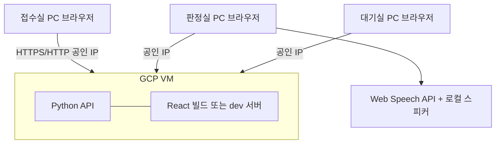
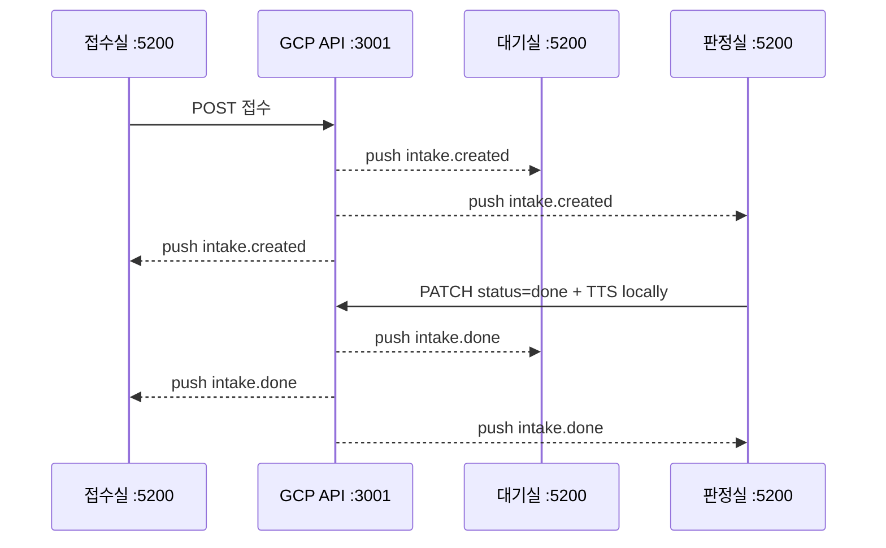
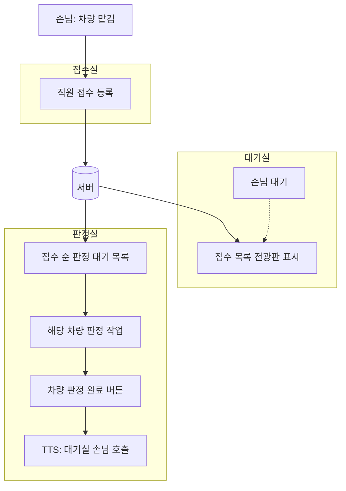
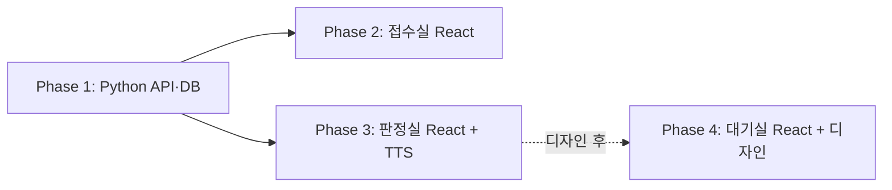
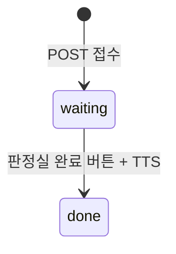

# 공업사 접수·대기·판정 웹 시스템 — 구현 계획서

> **이 문서만 보고 개발할 수 있도록** 대화 내용·결정 사항·구현 목록을 여기에 누적합니다.  
> 마지막 업데이트: 2026-05-29

---

## 1. 프로젝트 한 줄 요약

공업사 현장 **웹 기반** 시스템. 손님이 **차를 맡긴 뒤 접수실에서 접수**하면 **대기실**·**판정실** 목록에 반영되고, **판정실**은 **접수 순서대로 차량 판정**을 진행한다. **차량 판정이 끝난 뒤** 버튼을 누르면 **대기실에 있는 손님**에게 **TTS**로 «판정실로 와주세요»를 안내한다.

| 항목 | 내용 |
|------|------|
| 프론트엔드 | React |
| 백엔드 | Python |
| 실행 환경 | **웹 브라우저** (접수실·대기실·판정실 각 PC/모니터) |
| 공간(존) | **접수실**, **대기실**, **판정실** |
| 고객 셀프 접수(키오스크) | **없음** — 접수실 직원 접수 |
| 디자인 | **보유** — 존별 매핑·대기실 UI는 **추후** (`images/main/` 등) |
| 서버 | **GCP VM 1대** — 백엔드·프론트(화면) 모두 여기서 서비스 (§2.1) |
| 네트워크 | 현장 3존은 **망·IP 각각 다름** → 브라우저로 **GCP 공인 IP(또는 도메인)** 접속 |
| 1차 개발 | **백엔드** → **접수실·판정실** 화면 / **대기실 화면·디자인은 보류** |
| 핵심 연동 | 접수 → 목록 동기화 → **접수 순 차량 판정** → 판정 완료 시 **대기실 고객 TTS 호출** (전사 스피커) |

---

## 2. 확정된 기술 방향

- [x] UI: React
- [x] API/서버: Python
- [x] 배포 형태: 웹 기반 (브라우저)
- [x] 3존 구조: 접수실 / 대기실 / 판정실
- [x] 접수 필드: **차량번호·차종만**
- [x] TTS: **판정실 브라우저** → Web Speech API (§5.3) — 전사 스피커가 판정실 PC에 연결
- [x] TTS 후 목록: **삭제하지 않음**, 상태 **`done`(완료)** 로 표시
- [ ] Python 프레임워크 (FastAPI 권장 후보): **미정**
- [ ] DB 종류: **미정** (사용 가정)
- [x] **포트**: 프론트 **5200**, 백엔드 **3001** (§2.2)
- [x] **실시간 동기화 필수** — 폴링만으로는 부족, **WebSocket 또는 SSE** (§2.3)

### 2.1 네트워크·배포 (확정: GCP 단일 서버)

**호스팅**: 지금 작업 중인 **GCP 서버(VM) 1대**에서 **Python API + React 화면**을 모두 띄운다.



| 존 | PC | → GCP |
|----|-----|--------|
| 접수실 | 다른 망·IP | 브라우저로 **동일 GCP 주소** 접속 (예: `/reception`) |
| 판정실 | 다른 망·IP | 동일 GCP 주소 (예: `/assessment`) + **TTS는 판정실 PC에서만** 재생 |
| 대기실 | 다른 망·IP | (추후) 동일 GCP 주소 (예: `/waiting-display`) |

**접속 가능 여부 (결론)**

- **가능하다.** 3존이 **서로 다른 인터넷 망**이어도, 각 PC가 **인터넷으로 GCP 공인 IP(또는 연결된 도메인)** 에 도달하면 된다.
- 현장 PC에서 `localhost`가 아니라 **`http(s)://<GCP_외부IP>:<포트>/...`** 로 접속하는 구조.
- **망이 달라도** 같은 클라우드 주소를 보면 되므로, «단일 서버 주소» 요구사항을 GCP가 충족한다.

**개발·운영 원칙**

1. API·정적 화면은 **GCP에서 listen** (`0.0.0.0` 바인딩). 개발 중에는 외부 IP + 포트로 접근.
2. **GCP 방화벽** + VM 방화벽에서 **`3001`(API)·`5200`(프론트)** 인바운드 허용.
3. **CORS**: 프론트 오리진 `http://<GCP_외부IP>:5200` (존별 경로만 다름).
4. **`VITE_API_BASE_URL`**: `http://<GCP_외부IP>:3001` (또는 도메인).
5. **`VITE_WS_URL`** (또는 SSE URL): `ws://<GCP_외부IP>:3001/ws` 등 — 실시간용 (§2.3).
6. 데이터·실시간 이벤트는 **GCP 백엔드** 경유 (존 간 직접 통신 없음).
7. **TTS**는 **판정실 브라우저**만 (스피커는 판정실 PC).

### 2.2 포트 (확정)

| 서비스 | 포트 | 바인딩 | 비고 |
|--------|------|--------|------|
| **백엔드** (Python API + WebSocket/SSE) | **3001** | `0.0.0.0:3001` | REST + 실시간 |
| **프론트** (React dev 또는 preview) | **5200** | `0.0.0.0:5200` | Vite `--port 5200` |

**배포 URL 예시** (`<HOST>` = GCP 외부 IP 또는 도메인)

| 용도 | URL |
|------|-----|
| GCP 외부 IP | `___.___.___.___` (**미기입**) |
| 접수실 화면 | `http://<HOST>:5200/reception` |
| 판정실 화면 | `http://<HOST>:5200/assessment` |
| 대기실 화면 (추후) | `http://<HOST>:5200/waiting-display` |
| REST API | `http://<HOST>:3001/api/...` |
| 실시간 | `ws://<HOST>:3001/ws` 또는 `GET /api/events` (SSE) |

### 2.3 실시간 동기화 (확정 · P0)

**요구**: 접수·완료가 나면 **다른 존 화면이 즉시** 갱신된다. (폴링만 사용하지 않음)



| 이벤트 | 발생 시점 | 반영 대상 (구독 화면) |
|--------|-----------|------------------------|
| `intake.created` | 접수실 **접수 직후** | **대기실**, **판정실**, 접수실(목록) |
| `intake.updated` / `intake.done` | 판정실 **판정 완료** (`done`) | **대기실**, **접수실**, 판정실(완료 표시) |

**구현 방침 (1차)**

| 항목 | 결정 |
|------|------|
| 방식 | **WebSocket** (권장) 또는 **SSE** — 백엔드 `:3001`에서 브로드캐스트 |
| 트리거 | `POST /api/intakes` 성공 → `intake.created` broadcast |
| | `PATCH ... status=done` 성공 → `intake.done` broadcast |
| 프론트 | 접수·판정·(대기) 화면 마운트 시 **구독** → 이벤트 수신 시 목록 state 갱신 |
| 대기실 UI | 화면은 **보류**해도, **백엔드·WS는 1차에 구현** (나중에 UI만 연결) |
| 접수실 1차 | 접수 폼 + **당일 목록** — 판정 완료 시 **실시간으로 완료 반영** |

**페이로드 예시**

```json
{
  "type": "intake.created",
  "payload": {
    "id": "...",
    "plate_number": "12가3456",
    "vehicle_model": "GV80",
    "status": "waiting",
    "registered_at": "2026-05-29T10:00:00+09:00"
  }
}
```

```json
{
  "type": "intake.done",
  "payload": {
    "id": "...",
    "status": "done",
    "completed_at": "2026-05-29T10:15:00+09:00"
  }
}
```

**체크리스트 (현장 오픈 전)**

- [ ] GCP VM **외부 IP** 고정(Static) 여부
- [ ] 방화벽 **`3001`, `5200`** 오픈
- [ ] 접수실·판정실 PC 브라우저에서 GCP URL **ping/접속 테스트**
- [ ] (선택) 도메인 + HTTPS(Let’s Encrypt)

---

## 3. 업무 흐름 (확정)

### 3.1 현장 흐름 (한 줄 요약)

손님이 **차를 맡기고** → **접수실 접수** → **대기실에서 대기** → 판정실은 **접수 순서대로 맡긴 차량에 대한 판정(검사) 작업** → **그 차량의 판정이 끝나면** 버튼 → **대기실 손님**에게 TTS로 **판정실로 오라**고 안내.

> **중요**: TTS 시점은 «차량 판정 **완료 후**»이다. 판정실에서 **차만** 먼저 보고, 손님은 대기실에 있다가 **불려서** 판정실로 온다.

### 3.2 시나리오 (상세)



| 단계 | 장소 | 주체 | 행동 |
|------|------|------|------|
| 0 | 현장 | 손님 | 차량 **맡김** (주차 등) |
| 1 | 접수실 | 직원·손님 | 접수 등록 (**차량번호·차종만**) |
| 2 | 대기실 | 손님 | **대기** (접수 정보는 전광판에 표시) |
| 3 | 판정실 | 직원 | 접수 건이 **판정 목록**에 표시 (**접수 순** 처리) |
| 4 | 판정실 | 직원 | 맡긴 **차량에 대한 판정** 진행 (손님은 아직 대기실) |
| 5 | 판정실 | 직원 | **차량 판정 완료** → 버튼 클릭 |
| 6 | 전사 스피커 | 시스템 | TTS: «**0000 GV80** 차주님 **판정실로 와주시길** 바랍니다.» → **대기실 손님** 호출 |
| 7 | 판정실 | 손님 | (현장) 호출 후 판정실로 이동 — **시스템 범위 외** 가능 |

### 3.3 판정실 버튼 의미 (확정)

| 항목 | 결정 |
|------|------|
| 버튼 라벨 (UI 가칭) | **차량 판정 완료 · 고객 호출** |
| 클릭 시점 | 해당 건의 **차량 판정 업무가 끝난 뒤** |
| TTS 대상 | **대기실에 대기 중인** 해당 차량 손님 |
| TTS 목적 | 손님을 **판정실로 유도** (결과 안내·협의 등 현장 후속 업무) |
| 문구 | 판정 **전** «오세요»가 아니라, **차량 판정 후** «판정실로 와주세요» — **의도된 동작** |

### 3.4 TTS 문구 템플릿 (확정)

- 패턴: `{차량번호} {차종/모델} 차주님 판정실로 와주시길 바랍니다.`
- 예시: `0000 GV80 차주님 판정실로 와주시길 바랍니다.`

### 3.5 미정 (판정실 운영 UI)

- «판정 **시작**» 버튼을 둘지, 목록 **접수 순**만으로 운영할지
- 동시에 여러 대 판정 가능한지, **한 건씩**만 진행하는지

---

## 4. 화면·역할 (웹 앱)

URL 또는 라우트로 존별 화면을 분리합니다. **존마다 다른 망·IP**에서 각각 브라우저로 접속합니다.

| # | 화면 ID | 존 | 1차 구현 | 주요 기능 |
|---|---------|-----|----------|-----------|
| 1 | `reception` | 접수실 | **✅ P0** | 차량번호·차종 접수 폼, 당일 목록(선택) |
| 2 | `assessment` | 판정실 | **✅ P0** | 접수 순 목록, **완료·호출** 버튼, TTS, **완료** 건 목록에 유지 |
| 3 | `waiting-display` | 대기실 | **⏸ 보류** | 디자인 파일 확보 후 — **백엔드 API만 1차 준비** |

### 4.1 구현 순서 (확정)



| 순서 | 범위 |
|------|------|
| 1 | **백엔드** 전체 (대기실용 `GET` 포함) |
| 2 | **접수실** 프론트 |
| 3 | **판정실** 프론트 + TTS |
| 4 | **대기실** 프론트 (디자인·`images/` 매핑 후) |

**미정**: 접수 수정·취소, 로그인·권한

---

## 5. 기능 범위

### 5.1 포함 (대화 기준)

| ID | 기능 | 포함 | 우선순위 | 비고 |
|----|------|------|----------|------|
| F01 | 접수실: 접수 등록 (**차량번호·차종만**) | ✅ | P0 | §6 |
| F02 | 접수 건 저장·조회 | ✅ | P0 | DB |
| F03 | 대기실 목록 API + **실시간 구독** | ✅ | P0 | **UI 보류**, API·WS 1차 |
| F10 | **실시간** 접수→대기·판정 / 완료→대기·접수 | ✅ | P0 | §2.3, 폴링 단독 ❌ |
| F04 | 판정실: 접수 순 목록 | ✅ | P0 | |
| F05 | 판정실: 완료 버튼 → TTS → 상태 **`done`** | ✅ | P0 | 목록에서 **안 사라짐** |
| F06 | TTS (판정실 브라우저 → 전사 스피커) | ✅ | P0 | §5.3 T1 |
| F07 | **접수 순** 정렬 | ✅ | P0 | FIFO |
| F08 | 대기실 전광판 UI | ⏸ | P2 | 디자인 대기 |
| F09 | (선택) 판정 **시작** 버튼 | ⬜ | P1 | §3.5 |

### 5.2 제외·보류 (지금까지)

| ID | 기능 | 비고 |
|----|------|------|
| — | 고객 셀프 키오스크 발권 | 웹·직원 접수로 대체 |
| — | SMS / 알림톡 | 언급 없음 |
| — | 순번만(001, 002) 발급 | 차량 정보 중심으로 보임 |

### 5.3 TTS·스피커 (확정: T1)

| 항목 | 결정 |
|------|------|
| 재생 위치 | **판정실 PC** 브라우저 |
| 스피커 | 회사 **전체 방송 스피커**가 판정실 PC 오디오 출력에 **연결됨** |
| 구현 | **Web Speech API** (`speechSynthesis`) — 별도 방송 장비 API **없음** |
| 흐름 | `PATCH` 성공(또는 동시) → TTS 재생 → 실패 시에도 상태 정책은 §9 참고 |

1차에서 T2(서버 MP3)·T3(PA API)는 **사용하지 않음**.

---

## 6. 접수 데이터 (확정)

### 6.1 접수 폼 입력 (확정)

| 필드 | API 키 | 필수 | 비고 |
|------|--------|------|------|
| 차량번호 | `plate_number` | ✅ | 예: `0000` |
| 차종 | `vehicle_model` | ✅ | 예: `GV80` |

**포함하지 않음 (1차)**: 이름, 연락처, 메모, 접수번호, 보험사 등

### 6.2 시스템 필드

| 필드 | 비고 |
|------|------|
| `id` | UUID 또는 auto increment |
| `registered_at` | 접수 시각 — **FIFO 정렬** |
| `status` | `waiting` \| `done` (§9) |
| `completed_at` | (선택) `done` 전환 시각 |

---

## 7. 구현 목록 (마스터 체크리스트)

상태: `⬜ 대기` · `🔄 진행` · `✅ 완료` · `⏸ 보류` · `❌ 제외`

### Phase 0 — 기획·환경

| ID | 작업 | 상태 |
|----|------|------|
| P0-1 | 3존 흐름·버튼 의미 | ✅ |
| P0-2 | 접수 필드·상태 enum | ✅ |
| P0-3 | TTS·스피커 (판정실 브라우저) | ✅ |
| P0-4 | 3망·다른 IP 아키텍처 문서화 | ✅ |
| P0-5 | 1차 범위: 백엔드 → 접수·판정 / 대기실 UI 보류 | ✅ |
| P0-6 | 디자인 ↔ `images/` 매핑 | ⏸ |
| P0-7 | `frontend/`, `backend/` 폴더 생성 | ⬜ |

### Phase 1 — 백엔드 (Python) 【1차 · 최우선】

| ID | 작업 | 상태 |
|----|------|------|
| B1 | 프로젝트 스캐폴딩 (FastAPI 등) | ⬜ |
| B2 | 접수 모델: `plate_number`, `vehicle_model`, `status`, `registered_at` | ⬜ |
| B3 | `POST /api/intakes` — 접수 (차량번호·차종만) | ⬜ |
| B4 | `GET /api/intakes` — 쿼리: `zone=assessment` \| `waiting`, `date=today` | ⬜ |
| B5 | `PATCH /api/intakes/{id}` — `status: done` (완료, 목록 유지) | ⬜ |
| B6 | **CORS** — 3존 프론트 오리진 허용 (환경변수로 관리) | ⬜ |
| B7 | (권장) 당일 건만 조회·정렬 `registered_at ASC` | ⬜ |
| B8 | **WebSocket 또는 SSE** — `intake.created` / `intake.done` broadcast | ⬜ | **P0 필수** |
| B9 | 이벤트 페이로드·재연결 정책 | ⬜ |
| ~~B9~~ | ~~TTS 서버 MP3~~ | ❌ | T1으로 제외 |

### Phase 2 — 프론트: 접수실 【1차】

| ID | 작업 | 상태 |
|----|------|------|
| F-R1 | React 스캐폴딩, `/reception` 라우트 | ⬜ |
| F-R2 | 접수 폼 (차량번호·차종) + 제출 | ⬜ |
| F-R3 | `VITE_API_BASE_URL` → `:3001`, WS URL | ⬜ |
| F-R4 | 당일 접수 목록 + **WS로 완료 실시간 반영** | ⬜ |
| F-R6 | 접수 성공 시 목록 즉시 반영 (낙관적 or push) | ⬜ |
| F-R5 | 디자인 반영 | ⏸ | P0-6 후 |

### Phase 3 — 프론트: 판정실 【1차】

| ID | 작업 | 상태 |
|----|------|------|
| F-A1 | `/assessment` 라우트 | ⬜ |
| F-A2 | 접수 순 목록 (`waiting` + `done` 구분 표시) | ⬜ |
| F-A3 | **완료·호출** 버튼 → `PATCH done` → TTS | ⬜ |
| F-A4 | **WebSocket/SSE** — 타 접수실 신규 접수 즉시 목록 추가 | ⬜ |
| F-A5 | `done` 건 **완료** 라벨 (목록에서 제거하지 않음) | ⬜ |
| F-A6 | 디자인 반영 | ⏸ |

### Phase 4 — 대기실 【보류】

| ID | 작업 | 상태 |
|----|------|------|
| F-W1 | `/waiting-display` UI | ⏸ | 디자인 파일 대기 |
| F-W2 | 대기실 API 연동 | ⏸ | B4 완료 후 연결만 하면 됨 |
| F-W3 | `images/main/` 디자인 적용 | ⏸ |

### Phase 5 — 현장·테스트

| ID | 작업 | 상태 |
|----|------|------|
| I1 | GCP 외부 IP·포트·방화벽 — 3망에서 URL 접속 확인 | ⬜ |
| I2 | 접수실·판정실 URL 북마크 / 풀스크린 | ⬜ |
| I3 | 판정실 TTS → 전사 스피커 청음 테스트 | ⬜ |
| I4 | E2E: 접수(망A) → 판정 목록(망B) → TTS | ⬜ |
| I5 | (추후) 대기실(망C) 목록 표시 | ⏸ |

---

## 8. API 초안

| Method | Path | 설명 |
|--------|------|------|
| POST | `/api/intakes` | 접수 등록 |
| GET | `/api/intakes` | 목록 (`status`, `date` 쿼리) |
| GET | `/api/intakes/{id}` | 단건 |
| PATCH | `/api/intakes/{id}` | body: `{ "status": "done" }` — **완료** (목록 유지, §9) |
| GET | `/api/events` | (SSE 선택 시) `text/event-stream` 구독 |
| WS | `/ws` | (WebSocket 선택 시) 전역 브로드캐스트 |

**판정실 `GET` 예시**: `?zone=assessment&date=today` → `waiting` + `done` 모두 반환, UI에서 구분.

**실시간**: REST 성공 후 서버가 **모든 구독 클라이언트**에 이벤트 push (§2.3).

**TTS**: 판정실 프론트 — `PATCH` 성공 후 `speechSynthesis` (§5.3). TTS는 push와 **병행** (판정실만 로컬 재생).

**접수 `POST` body 예시**:

```json
{ "plate_number": "12가3456", "vehicle_model": "GV80" }
```

---

## 9. 상태 전이 (확정 · 1차 단순화)



| 상태 | 한글 | 의미 | 판정실 목록 | TTS 후 |
|------|------|------|-------------|--------|
| `waiting` | 대기 | 접수됨, 차량 판정·호출 **대기** | 표시, **완료 버튼** 활성 | — |
| `done` | 완료 | 차량 판정 끝, 고객 **호출(TTS) 완료** | **그대로 표시**, «완료» 표시 | **삭제하지 않음** |

**정렬 (확정)**: `registered_at` **오름차순** (FIFO).

**판정실 UI (1차)**: `waiting` / `done` 한 목록 또는 탭 없이 구분 스타일(취소선·배지 «완료»).

**대기실 API (1차)**: `zone=waiting` — `waiting` 건만 또는 전체 정책은 **대기실 UI 작업 시 확정** (현재 UI 보류).

---

## 10. 디자인·에셋

| 항목 | 값 |
|------|-----|
| repo 내 경로 (참고) | `images/logo/`, `images/main/` |
| 존별 매핑 | **추후** — 사용자 디자인 파일·대기실 화면 검색 중 |
| 1차 UI | 접수·판정은 **기능 위주** 레이아웃 가능, 디자인은 P0-6 후 반영 |

---

## 11. 개발 시 공통 규칙

- 커밋 메시지: **한국어**
- 실행·배포: 개발자가 로컬에서 직접 수행
- 본 문서가 **단일 소스 of truth**

---

## 12. 대화 로그

### 2026-05-29 — 프로젝트 시작

- React + Python, MD로 구현 목록 관리
- 초기 가정: 키오스크 순번 발권 → **이후 수정**

### 2026-05-29 — 3존 웹·접수·TTS (확정)

**사용자**

1. **웹 기반**
2. 존: **접수실**, **판정실**, **대기실**
3. 손님은 접수실에서 **직원이 접수**
4. 접수 정보 → **대기실 표시** + **판정실 새 판정 목록**
5. 판정실에서 **판정 완료** 시 버튼 → **판정실(전사) 스피커 TTS**:  
   «`0000` `GV80` 차주님 판정실로 와주시길 바랍니다.»

**에이전트**

- 문서 전면 개편: 키오스크 모델 제거, 3존·TTS 중심으로 재작성
- 버튼 시점(호출 vs 완료) 확인 항목 추가

### 2026-05-29 — 차량 판정 완료 후 대기실 손님 호출 (확정)

**사용자**

- 차 맡김 → 접수실 접수 → **접수 순**으로 판정실에서 **차량 판정** 진행
- **차량 판정이 끝난 뒤** 같은 TTS 문구로 **대기실 손님**에게 «판정실로 와주세요» 안내
- (이전 질문 B) **판정 업무 완료 후** 호출이 맞음 — 손님은 판정 동안 **대기실**에 있음

**에이전트**

- §3 현장 흐름·버튼 의미 확정, §9 상태 전이·FIFO 정렬 반영
- §13에서 버튼 의미 질문 제거

### 2026-05-29 — 1차 범위·필드·3망·완료 상태 (확정)

**사용자**

- 접수: **차량번호·차종만**
- 대기실 UI: 디자인 찾는 중 → **백엔드 먼저**, 대기실 화면 **나중**
- TTS 후 판정 목록: **사라지지 않고 «완료»로 변경**
- TTS: **판정실 브라우저** ↔ 전사 스피커 연결
- 디자인·`images/` 매핑: **나중**
- **1차 작업**: **접수실·판정실** 화면 (대기실 대기)
- **접수실·판정실·대기실 각각 다른 IP, 서로 다른 인터넷 망**

**에이전트**

- §2.1 3망 아키텍처, §4.1 구현 순서, §6·§9 단순화(`waiting`/`done`)
- Phase 1~4 체크리스트 재구성

### 2026-05-29 — GCP 단일 서버 배포 (확정)

**사용자**

- 지금 **GCP 서버**에서 작업 중
- **화면(프론트) + 백엔드** 모두 이 GCP에서 띄울 예정 → 3존에서 여기로 접속 가능한지

**에이전트**

- **가능** — 3망이 달라도 각 PC 브라우저가 **GCP 공인 IP/도메인**만 열리면 됨
- §2.1 GCP 아키텍처·방화벽·URL 예시 반영
- TTS만 판정실 로컬, API/화면은 GCP

### 2026-05-29 — 포트·실시간 동기화 (확정)

**사용자**

- 프론트 **5200**, 백엔드 **3001**
- **실시간 중요**
  - 접수실 접수 즉시 → **대기실·판정실**에 접수 내역 표시
  - 판정실 판정 종료 → **대기실·접수실**에 완료 반영

**에이전트**

- §2.2 포트, §2.3 실시간 이벤트·시퀀스 반영
- B8 WebSocket/SSE **P0 필수**, 접수실 목록·완료 push 포함

---

## 13. 다음 대화에서 정할 것

1. **GCP 외부 IP** 실제 값 (§2.2 `<HOST>` 기입)
2. **WebSocket vs SSE** 최종 선택 (권장: WebSocket)
3. **판정 시작** 버튼 필요 여부 / 동시 판정 대수
4. **당일만** 목록 vs 이전 날짜 조회
5. **대기실** 목록 정책 (전원 표시 vs `waiting`만) — UI 작업 시
6. 접수 **수정·취소** 필요 여부

---

## 14. 변경 이력

| 날짜 | 변경 |
|------|------|
| 2026-05-29 | 문서 최초 작성 (키오스크 가정) |
| 2026-05-29 | 3존 웹·직원 접수·TTS 흐름으로 전면 수정 |
| 2026-05-29 | 차량 판정 완료 후 대기실 고객 호출·FIFO 확정 |
| 2026-05-29 | 접수 2필드, done 유지, 3망, 1차 백엔드+접수·판정 확정 |
| 2026-05-29 | 호스팅 GCP 단일 VM (API+프론트), 3망→공인 IP 접속 |
| 2026-05-29 | 포트 5200/3001, 실시간 push(접수·완료) P0 확정 |
